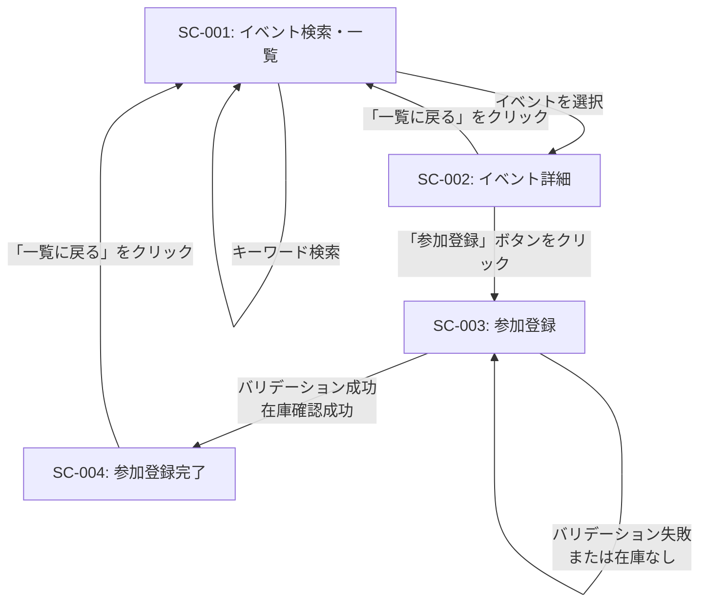

# 画面設計書

## 1. 画面一覧

| 画面ID | 画面名             | 概要                                                                         | 主な機能（ボタン等）                                                       |
| ------ | ------------------ | ---------------------------------------------------------------------------- | -------------------------------------------------------------------------- |
| SC-001 | イベント検索・一覧 | 公開されている開催予定のイベント一覧を表示し、キーワードで検索できる画面     | 検索フォーム（キーワード入力）、検索ボタン、イベント一覧から詳細へのリンク |
| SC-002 | イベント詳細       | 選択されたイベントの詳細情報（日時、場所、概要、チケット情報）を表示する画面 | チケット一覧、「参加登録」ボタン、「一覧に戻る」ボタン                     |
| SC-003 | 参加登録           | イベント参加の登録情報（メールアドレスとチケット種別）を入力・確認する画面   | メールアドレス入力欄、チケット選択ドロップダウン、「登録する」ボタン       |
| SC-004 | 参加登録完了       | イベント参加登録が正常に完了したことを示す画面                               | 「一覧に戻る」ボタン                                                       |

## 2. 画面遷移図

## 3. 画面遷移の説明

### SC-001: イベント検索・一覧

- **entry**: ユーザーが最初に表示できる画面（ログイン不要）
- **遷移先**:
  - イベント一覧からイベントを選択 → SC-002へ遷移
  - キーワード検索 → 同画面内で検索結果を更新

### SC-002: イベント詳細

- **entry**: SC-001からイベント選択
- **処理**:
  - イベント名、開催日時、場所、概要、チケット種別・価格・残数を表示
- **遷移先**:
  - 「参加登録」ボタン → SC-003へ遷移
  - 「一覧に戻る」ボタン → SC-001へ戻る

### SC-003: 参加登録

- **entry**: SC-002から「参加登録」ボタン選択
- **処理**:
  - メールアドレス入力欄、チケット選択ドロップダウンを表示
  - メールアドレス形式チェック、チケット選択必須チェックを実施
  - バリデーション成功後、チケット在庫確認を実施
- **遷移先**:
  - バリデーション・在庫確認成功 → SC-004へ遷移
  - バリデーション失敗または在庫なし → 同画面内でエラー表示

### SC-004: 参加登録完了

- **entry**: SC-003から参加登録成功
- **処理**:
  - 登録完了メッセージを表示
- **遷移先**:
  - 「一覧に戻る」ボタン → SC-001へ遷移

## 4. 対応する機能要件

| 画面ID | 対応する機能ID                                 |
| ------ | ---------------------------------------------- |
| SC-001 | FR-001, FR-002, FR-003, FR-004                 |
| SC-002 | FR-005, FR-006, FR-007, FR-008, FR-009, FR-010 |
| SC-003 | FR-011, FR-012, FR-013, FR-014                 |
| SC-004 | FR-015                                         |
