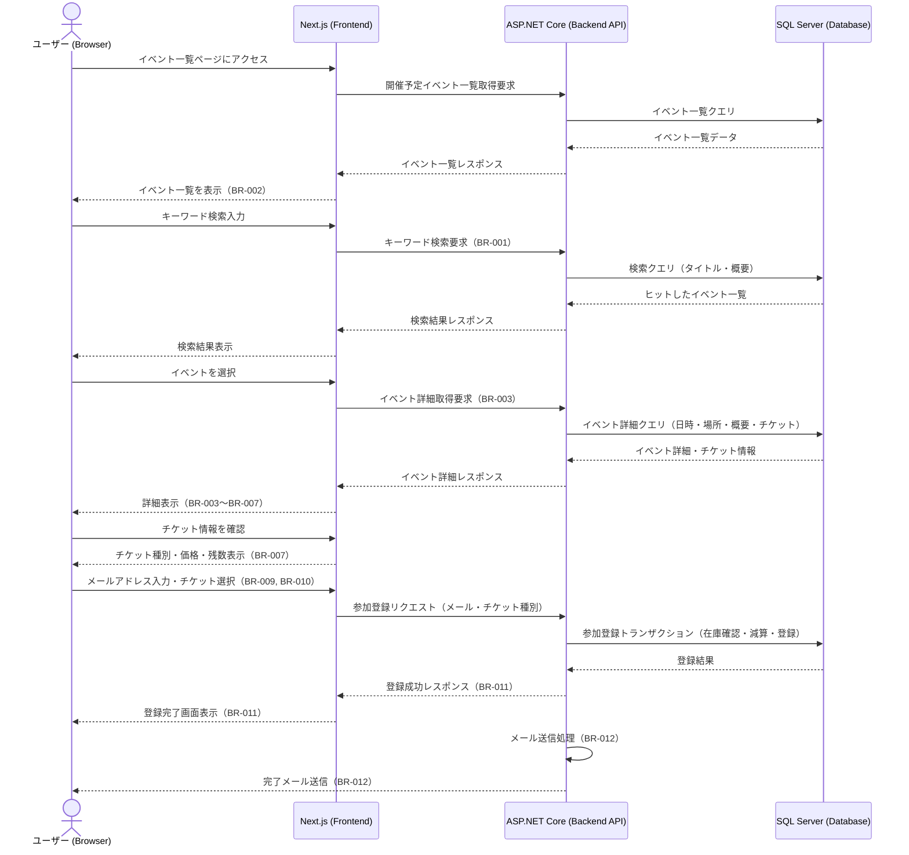

# システム化業務フロー（イベント検索〜参加登録）

```mermaid
sequenceDiagram
    actor User as ユーザー (Browser)
    participant FE as Next.js (Frontend)
    participant API as ASP.NET Core (Backend API)
    participant DB as SQL Server (Database)

    %% イベント探索（一覧・検索）
    User->>FE: イベント一覧ページにアクセス
    FE->>API: 開催予定イベント一覧取得要求
    API->>DB: イベント一覧クエリ
    DB-->>API: イベント一覧データ
    API-->>FE: イベント一覧レスポンス
    FE-->>User: イベント一覧を表示（BR-002）

    User->>FE: キーワード検索入力
    FE->>API: キーワード検索要求（BR-001）
    API->>DB: 検索クエリ（タイトル・概要）
    DB-->>API: ヒットしたイベント一覧
    API-->>FE: 検索結果レスポンス
    FE-->>User: 検索結果表示

    %% イベント詳細確認
    User->>FE: イベントを選択
    FE->>API: イベント詳細取得要求（BR-003）
    API->>DB: イベント詳細クエリ（日時・場所・概要・チケット）
    DB-->>API: イベント詳細・チケット情報
    API-->>FE: イベント詳細レスポンス
    FE-->>User: 詳細表示（BR-003〜BR-007）

    %% チケット確認
    User->>FE: チケット情報を確認
    FE-->>User: チケット種別・価格・残数表示（BR-007）

    %% 参加登録
    User->>FE: メールアドレス入力・チケット選択（BR-009, BR-010）
    FE->>API: 参加登録リクエスト（メール・チケット種別）
    API->>DB: 参加登録トランザクション（在庫確認・減算・登録）
    DB-->>API: 登録結果
    API-->>FE: 登録成功レスポンス（BR-011）
    FE-->>User: 登録完了画面表示（BR-011）

    %% 登録完了メール
    API->>API: メール送信処理（BR-012）
    API-->>User: 完了メール送信（BR-012）
```
