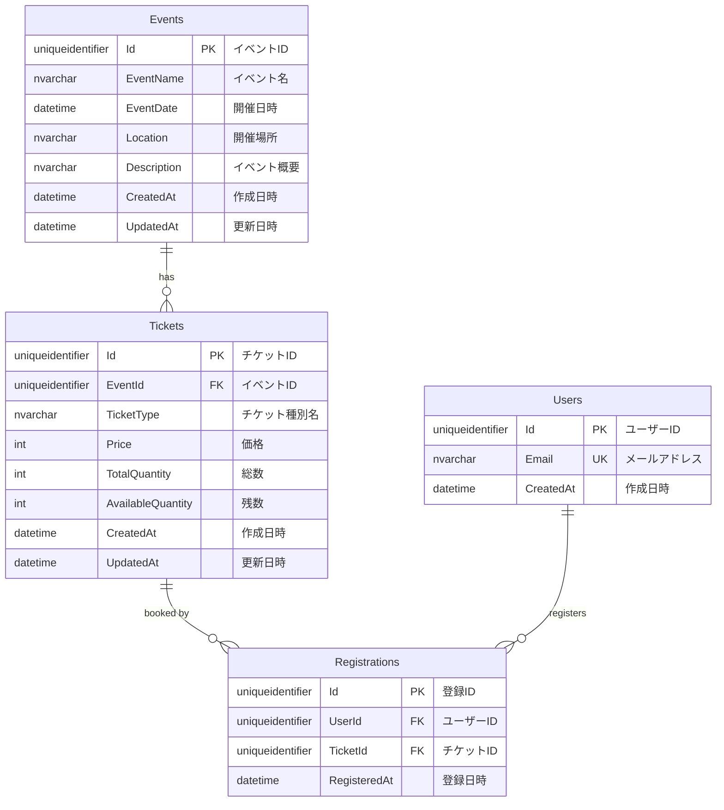

# データベース設計（ER図）

## エンティティ関連図

## エンティティ詳細

### Events（イベント）
- **説明**: イベント基本情報を管理
- **主キー**: Id
- **対応機能**: FR-003, FR-005～FR-009

### Tickets（チケット）
- **説明**: イベントごとのチケット種別と在庫を管理
- **主キー**: Id
- **外部キー**: EventId → Events.Id
- **対応機能**: FR-005, FR-010, FR-012

### Users（ユーザー）
- **説明**: イベント参加者の情報を管理（メールアドレスベース）
- **主キー**: Id
- **ユニークキー**: Email
- **対応機能**: FR-009, FR-011, FR-013～FR-016

### Registrations（参加登録）
- **説明**: 参加者の登録情報を管理
- **主キー**: Id
- **外部キー**: 
  - UserId → Users.Id
  - TicketId → Tickets.Id
- **対応機能**: FR-011～FR-016

## リレーションシップ

| 関係 | カーディナリティ | 説明 |
|------|------------------|------|
| Events → Tickets | 1対多 | 1つのイベントは複数のチケット種別を持つ |
| Tickets → Registrations | 1対多 | 1つのチケット種別に対して複数の参加登録が可能 |
| Users → Registrations | 1対多 | 1人のユーザーは複数のイベントに参加登録可能 |

## インデックス設計（推奨）

- Events.EventName（検索用）
- Events.EventDate（開催予定イベント抽出用）
- Tickets.EventId（イベント詳細取得用）
- Users.Email（UNIQUE、参加登録時の検索・重複チェック用）
